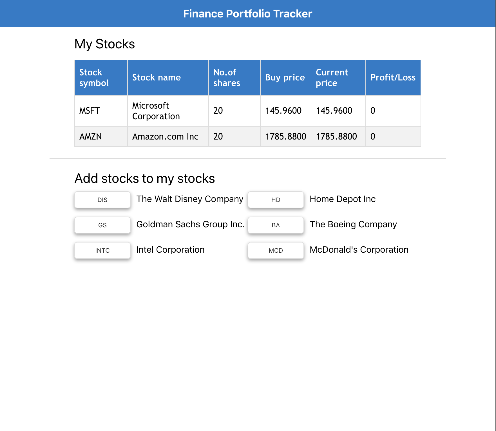

# Finance Portfolio Tracker

This project was bootstrapped with [Create React App](https://github.com/facebook/create-react-app). A big chunk of this project credit goes to [Alpha Vantage](https://www.alphavantage.co/) - the leading provider of free APIs for realtime and historical data on stocks, forex (FX), and digital/crypto currencies.

 

## Overview

Finance Portfolio Tracker (FPT) is a simple web application created in conjunction with Alpha Vantage's amazing free APIs. At the time of writing, FPT can track five stocks [Refer image below for more description]. You can track the profit/loss of your selected stock compared against the date on which you bought the stock.

 

*Note: This project is a sample project created for GreyAtom's Front-End Web Development program using React only. Future versions of the product, if developed, will add the functionality of Redux and react-router.*

 

## Learn More

GreyAtom is doing a spectacular job at making graduates ready for their first job. Read more about GreyAtom and their services [here](https://greyatom.com/).

You can learn more about Create React App in the [Create React App documentation](https://facebook.github.io/create-react-app/docs/getting-started).

To learn React, check out the [React documentation](https://reactjs.org/).

 

## Want to connect with me?

I'm working with one of the sharpest brains in the business at [Eugenie.ai](https://eugenie.ai/) as we go about Spot.Explore.Exploit.

You can connect with me on [LinkedIn](https://www.linkedin.com/in/rushabh-shah-83869a95/) or hit me up on [shahrushabh1993@gmail.com](shahrushabh1993@gmail.com).
